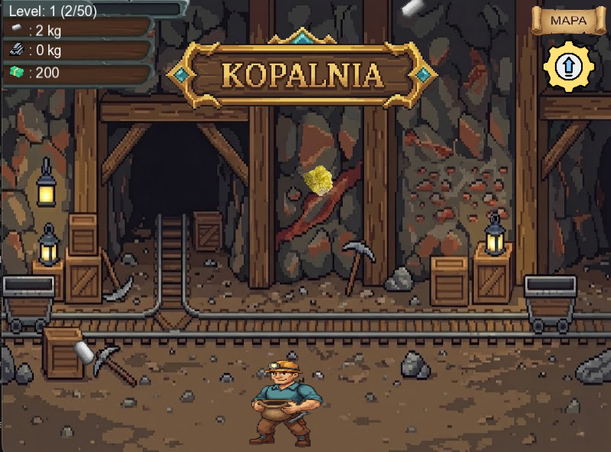
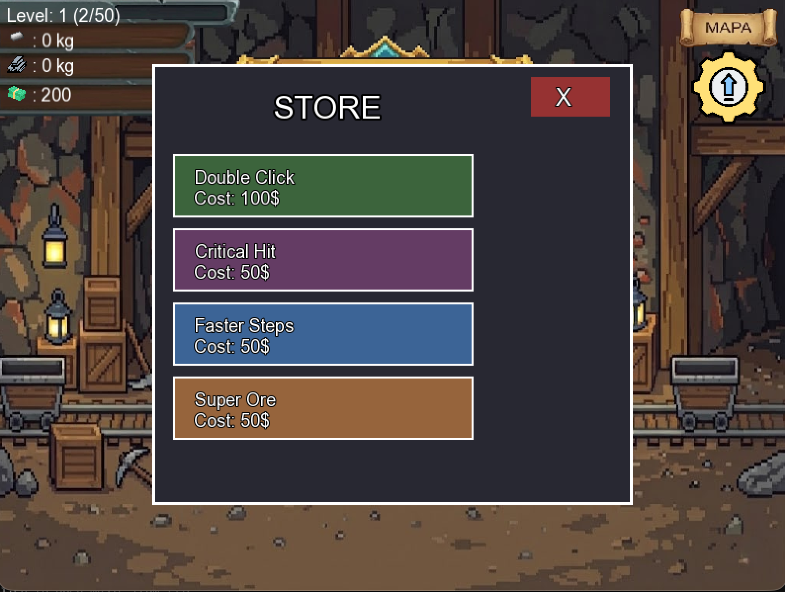
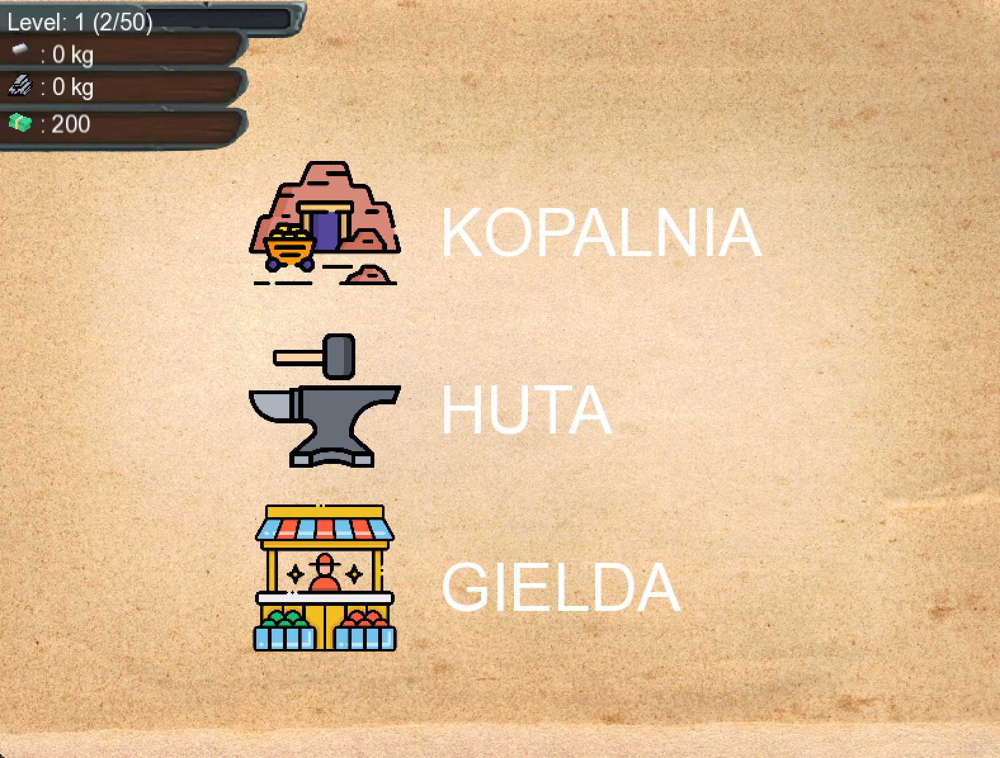
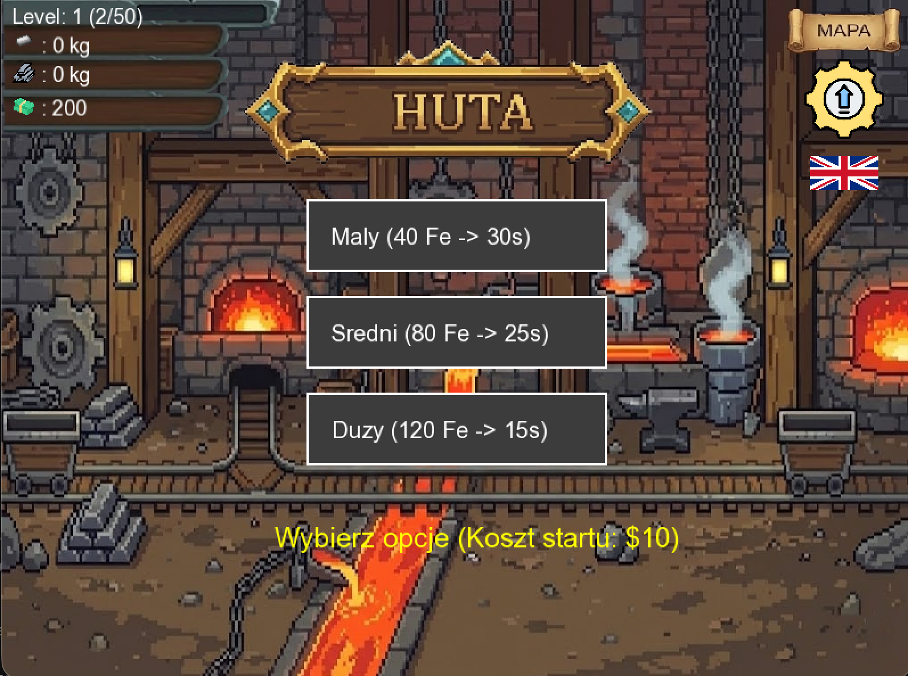

# ⛏️ Deszcz żelaza


Prosta gra platformowa 2D o tematyce górniczej, napisana w C++ z wykorzystaniem najnowszej biblioteki **SFML 3.0**.

Wcielasz się w postać górnika, który musi łapać spadające z nieba bryłki żelaza, unikać niebezpieczeństw i budować swoje imperium poprzez przetwarzanie surowców i ulepszanie ekwipunku.

## 🎮 Rozgrywka (Gameplay)

Pętla rozgrywki opiera się na prostym cyklu ekonomicznym:
**Zbierz ➡️ Przetwórz ➡️ Sprzedaj ➡️ Ulepsz**

### Główne mechaniki:
* **Zbieranie (Collecting):** Poruszaj się po platformach i łap spadające kawałki rudy żelaza, zanim znikną.
* **Przetapianie (Smelting):** Zanieś zebraną rudę do pieca, aby przetopić ją na sztabki stali.
* **Handel (Selling):** Sprzedaj gotową stal na rynku, aby zarobić gotówkę.
* **System Ulepszeń (Upgrades):** Wykorzystaj zarobione pieniądze, aby ulepszyć swoją postać:

## 📸 Zrzuty ekranu






## 🛠️ Technologie

Projekt został zrealizowany przy użyciu:
* **Język:** C++ (Standard C++17)
* **Biblioteka:** [SFML 3.0](https://www.sfml-dev.org/)
* **System budowania:** Makefile

## 🚀 Instalacja i kompilacja

Aby uruchomić projekt, potrzebujesz kompilatora C++ oraz narzędzia Make.

### 1. Klonowanie repozytorium

```bash
git clone https://github.com/twoj-nick/nazwa-gry.git
cd nazwa-gry
```

### 2. Uruchomienie gry

Skompiluj projekt wybierając platformę (`windows`, `mac`, `linux`):

```bash
make windows
# lub: make linux / make mac
```

Następnie uruchom plik wykonywalny:

```bash
./main.exe
# lub na linux/mac: ./main
```

> **Uwaga:** Upewnij się, że pliki zasobów (tekstury, czcionki) znajdują się w tym samym folderze co plik wykonywalny.

## 🕹️ Sterowanie

| Klawisz | Akcja |
| :---: | :--- |
| **A / D** | Poruszanie się (Lewo / Prawo) |
| **Esc** | Wyjście / Pauza |


---
